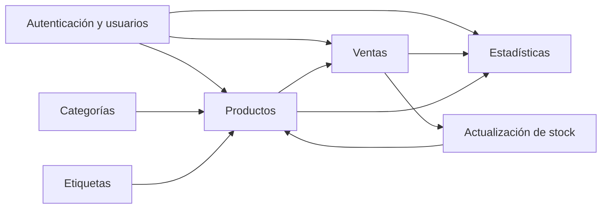
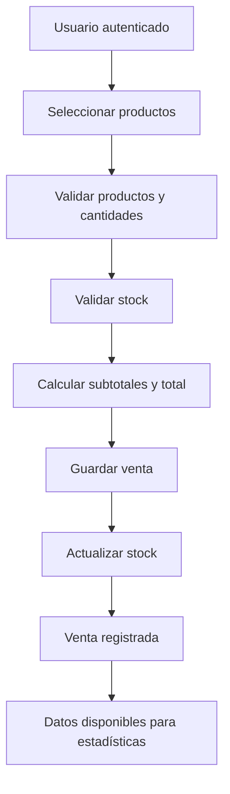

# 12. Módulos del sistema

## 12.1 Módulo de autenticación y usuarios

### Funcionalidades

- Registro de usuarios.
- Inicio de sesión.
- Autenticación mediante JWT.
- Roles.
- Permisos.
- Asociación del usuario con un negocio.
- Diferenciación de acceso según el rol.
- Soporte para varios usuarios trabajando sobre un mismo negocio.

### Justificación

Este módulo es necesario porque el sistema contempla colaboración entre varias personas de un mismo negocio. La autenticación permite identificar al usuario y la autorización permite determinar qué operaciones puede realizar.

JWT fue seleccionado porque forma parte del stack definido y permite mantener la API REST sin depender de una sesión tradicional del servidor.

---

## 12.2 Módulo de productos

### Funcionalidades

- Alta de productos.
- Consulta de productos.
- Modificación de productos.
- Baja lógica.
- Consulta de stock.
- Definición de stock mínimo.
- Estado activo/inactivo.
- Asociación con una categoría.
- Asociación con múltiples etiquetas.
- Registro de precio de venta.
- Registro de costo.

### Justificación

Los productos constituyen una de las entidades principales del sistema. El módulo centraliza la información necesaria para vender, controlar stock y generar estadísticas.

La baja lógica permite conservar la información histórica sin eliminar físicamente productos que pudieron participar en ventas anteriores.

---

## 12.3 Módulo de ventas

### Funcionalidades

- Crear una venta.
- Seleccionar productos.
- Registrar cantidades.
- Calcular el total.
- Registrar fecha y hora.
- Registrar usuario responsable.
- Registrar medio de pago.
- Mantener el detalle de los productos vendidos.
- Mantener estado de la venta.
- Actualizar el stock.

### Datos principales

Una venta contempla:

- `date`
- `userId`
- `details`
  - `productId`
  - `quantity`
  - `unitPrice`
  - `subtotal`
- `total`
- `paymentMethod`
- `status`

### Justificación

Este módulo es central para el valor agregado de la propuesta. La venta no se almacena solamente como fecha y monto, sino con el detalle de productos.

Esto permite posteriormente:

- Conocer productos más vendidos.
- Calcular facturación.
- Analizar ganancias.
- Actualizar stock.
- Mantener un historial detallado.

El detalle se mantiene embebido dentro de la venta porque los productos que componen una operación se consultan normalmente junto con la venta y forman parte de la misma operación histórica.

---

## 12.4 Módulo de estadísticas

### Funcionalidades

- Cantidad de ventas.
- Facturación.
- Producto más vendido.
- Producto con mayor facturación.
- Producto con mayor ganancia.
- Estadísticas por período.
- Productos con stock bajo.

### Justificación

Las estadísticas representan uno de los principales diferenciadores del proyecto. El objetivo no es solamente registrar información, sino convertir los datos de las operaciones en información útil para la toma de decisiones.

MongoDB permite utilizar operaciones de agregación para obtener indicadores a partir de las ventas almacenadas.

El MVP comenzará con indicadores concretos para evitar agregar complejidad innecesaria.

---

## 12.5 Módulo de categorías y etiquetas

### Categorías

Funcionalidades:

- Crear categoría.
- Consultar categorías.
- Modificar categoría.
- Asociar categoría a productos.
- Utilizar categoría como criterio de organización y consulta.

### Etiquetas

Funcionalidades:

- Crear etiqueta.
- Consultar etiquetas.
- Modificar etiqueta.
- Asociar múltiples etiquetas a un producto.
- Utilizar etiquetas como criterios de filtrado.

### Justificación

Las categorías permiten establecer una clasificación principal de los productos, mientras que las etiquetas permiten una clasificación más flexible.

Se utiliza una relación de una categoría por producto y múltiples etiquetas por producto porque un producto puede pertenecer a una categoría principal pero necesitar varios atributos de clasificación.

---

## 12.6 Relación entre módulos

## 12.7 Flujo principal de una venta

## 12.8 Priorización para el MVP

El orden de implementación recomendado es:

1. Autenticación y usuarios.
2. Productos.
3. Categorías y etiquetas.
4. Ventas.
5. Actualización de stock.
6. Estadísticas.
7. Integración y pruebas.

Esta prioridad coincide con las dependencias del sistema: las ventas necesitan productos y usuarios; las estadísticas necesitan ventas registradas; y el control de stock depende de los productos y las ventas.
