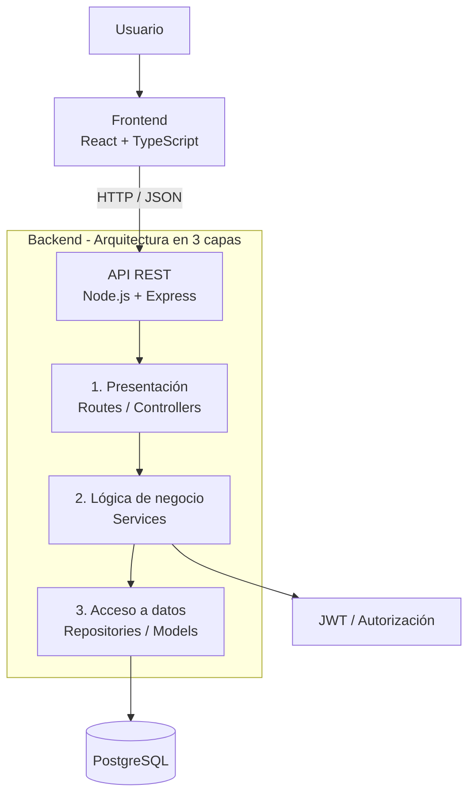
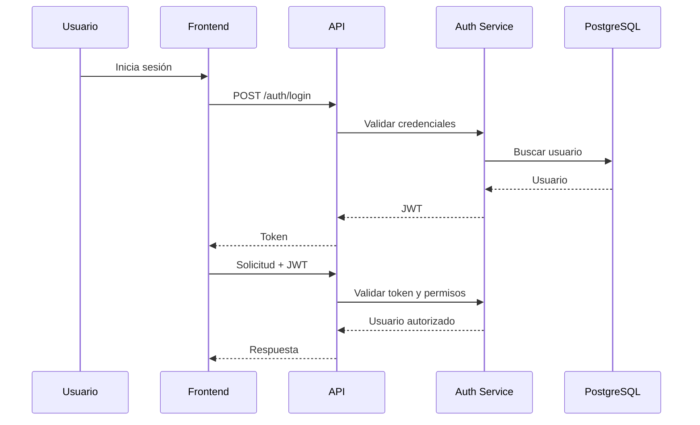

# 11. Arquitectura del sistema

## 11.1 Arquitectura seleccionada

El sistema utilizará una **arquitectura de tres capas**:

1. **Capa de presentación**
2. **Capa de lógica de negocio**
3. **Capa de acceso a datos**

La arquitectura se complementará con una API REST y autenticación mediante JWT.

## 11.2 Diagrama general



## 11.3 Capa 1 - Presentación

Esta capa recibe las solicitudes HTTP y devuelve las respuestas.

### Frontend

Tecnología:

- React.
- TypeScript.

Responsabilidades:

- Mostrar la interfaz.
- Formularios.
- Tablas y listados.
- Dashboard.
- Validaciones básicas de entrada.
- Enviar solicitudes a la API.
- Mantener el estado de la interfaz.
- Mostrar mensajes de éxito o error.

### Backend - Controllers y Routes

Express recibe las solicitudes y las deriva al controlador correspondiente.

Responsabilidades:

- Definir endpoints.
- Obtener parámetros, body y usuario autenticado.
- Validar datos de entrada.
- Invocar los servicios correspondientes.
- Construir respuestas HTTP.

Esta capa no debería contener reglas de negocio complejas.

## 11.4 Capa 2 - Lógica de negocio

La capa de servicios concentra las reglas del sistema.

Ejemplos:

- Verificar permisos.
- Comprobar que un producto exista.
- Validar stock suficiente.
- Calcular el total de una venta.
- Actualizar stock.
- Determinar estadísticas.
- Aplicar reglas de baja lógica.
- Coordinar operaciones que involucran varias entidades.

Esta separación evita que las reglas de negocio queden mezcladas con las rutas HTTP o con las consultas a PostgreSQL.

## 11.5 Capa 3 - Acceso a datos

Esta capa es responsable de comunicarse con PostgreSQL, alojado en Neon.

Responsabilidades:

- Consultar, insertar y actualizar registros.

- Aplicar filtros y consultar información relacionada entre tablas.

- Obtener los datos necesarios para las estadísticas.

- Ejecutar las operaciones de persistencia dentro de las transacciones coordinadas por los servicios.

- Concentrar el acceso a la base de datos en los repositorios.

Los servicios definen las reglas del negocio y utilizan los repositorios para acceder a los datos, sin encargarse de los detalles de conexión.

## 11.6 Autenticación y autorización

JWT se utilizará para identificar al usuario.

Flujo simplificado:



## 11.7 Roles

El sistema contempla roles para diferenciar el acceso a las funcionalidades.

El rol inicial definido para el proyecto contempla:

- **Admin:** responsable de la administración del comercio y de los usuarios.
- **Employee:** usuario que trabaja con las operaciones permitidas del comercio.

Los permisos concretos se implementarán mediante middleware de autorización y reglas de negocio.

## 11.8 Justificación de la arquitectura

La arquitectura de tres capas fue elegida por las siguientes razones:

- Separa responsabilidades.
- Facilita el mantenimiento.
- Permite desarrollar frontend y backend de manera independiente.
- Facilita las pruebas.
- Evita mezclar reglas de negocio con acceso a datos.
- Es adecuada para una API REST con Node y Express.
- Se adapta al tamaño y alcance del MVP.
- Es una arquitectura conocida y viable para el equipo.

No se considera necesario utilizar una arquitectura más compleja, como microservicios, para el MVP debido al tamaño del proyecto y a los tiempos disponibles.

## 11.9 Estructura tentativa del backend

```text
apps/api/
├── src/
│   ├── config/
│   ├── routes/
│   ├── controllers/
│   ├── services/
│   ├── repositories/
│   ├── middlewares/
│   ├── validators/
│   ├── types/
│   ├── app.ts
│   └── server.ts
├── migrations/
├── .env
├── package.json
└── tsconfig.json
```
## 11.11 Estructura tentativa del frontend

```text
apps/client/
├── public/
├── src/
│   ├── assets/
│   ├── components/
│   ├── layouts/
│   ├── pages/
│   ├── routes/
│   ├── services/
│   ├── hooks/
│   ├── context/
│   ├── types/
│   ├── styles/
│   ├── App.tsx
│   └── main.tsx
├── index.html
├── package.json
├── tsconfig.json
├── tsconfig.app.json
├── tsconfig.node.json
├── vite.config.ts
└── eslint.config.js
```

Estas estructuras son una propuesta de organización. Las carpetas y los archivos se incorporarán a medida que se desarrollen las funcionalidades y podrán ajustarse según las necesidades del equipo.
