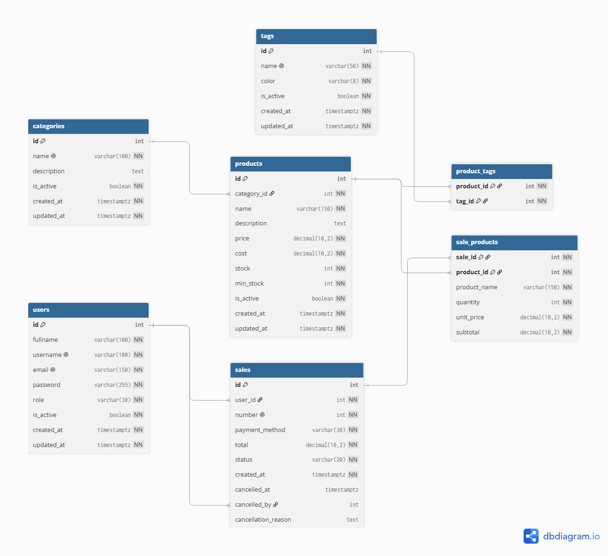

# Base de datos: modelo relacional

Este documento define el modelo de datos del sistema. Es la fuente de referencia del esquema: cualquier cambio posterior debe verse reflejado acá y aplicarse mediante una migración sobre la base de datos.

La base de datos sobre la que se ejecuta es PostgreSQL, y el acceso se realiza mediante Prisma, según lo definido en `docs/stack-tecnologico/02-decisiones.md`. El esquema se define en formato DBML, en el archivo `dbml.dbml` de esta misma carpeta, y el diagrama del modelo se muestra en la sección siguiente.

---

## 1. Criterios de diseño

Antes de definir las entidades se fijan algunos criterios que después se aplican de manera uniforme.

**Alcance del sistema.** La aplicación se despliega para un comercio concreto. No es un servicio que atienda a múltiples comercios desde una misma instalación, por lo que el modelo no contempla una entidad de negocio: todos los datos pertenecen al comercio para el que se instala el sistema. El aislamiento entre negocios, que se había considerado en una etapa anterior, no aplica.

**Identificadores.** Las tablas usan un identificador numérico autoincremental. Es el tipo de clave más eficiente para el acceso por índice y el que mejor se comporta en las consultas del sistema, donde el identificador se utiliza como único criterio de búsqueda o acompañado por algún otro filtro.

**Importes.** Los campos que representan dinero se definen con precisión decimal fija y dos decimales. No se usan números de coma flotante, porque no pueden representar de forma exacta valores como 0,10 y las operaciones aritméticas entre ellos acumulan diferencias de centavos. El mismo criterio se aplica al precio unitario de un renglón de venta, que es una copia del precio del producto.

**Cantidades.** Los campos que representan cantidades de productos o de existencias son enteros. Se agregan restricciones de verificación para que no admitan valores negativos.

**Fechas.** Las fechas se definen con zona horaria, de modo que el instante almacenado sea inequívoco independientemente de dónde se lea. Se guarda en UTC y la conversión a la zona horaria del usuario se realiza al presentar la información.

**Baja lógica.** Las entidades que se conservan porque pueden formar parte de información histórica no se eliminan de la base de datos: se marcan como inactivas mediante la columna `is_active`. Esto aplica a usuarios, categorías, etiquetas y productos. Se conservan así porque pueden haber participado en ventas anteriores, y eliminar los registros rompería el historial y las estadísticas.

Las ventas no utilizan este mecanismo porque no se editan: una venta se registra y, eventualmente, se anula. Por eso utilizan un estado propio que distingue una venta completada de una venta anulada, en lugar de un campo activo/inactivo.

**Registros de fecha.** Todas las tablas incluyen `created_at`. Las entidades que se editan con frecuencia incluyen también `updated_at`, que se actualiza automáticamente. Las ventas no lo incluyen porque su contenido no se modifica una vez registradas.

---

## 2. Diagrama del modelo



El diagrama muestra las entidades del sistema, sus columnas y las relaciones entre ellas.

La definición que genera este diagrama se encuentra en el archivo `dbml.dbml`, dentro de la misma carpeta. Ese archivo puede editarse y exportarse directamente desde [dbdiagram.io](https://dbdiagram.io). Cualquier modificación del modelo debe realizarse primero en `dbml.dbml` y luego exportarse como imagen para reemplazar `db-model.png`, de modo que ambos artefactos queden siempre sincronizados.

---

## 3. Entidades

### 3.1 users

Usuarios que operan el sistema. El comercio puede tener varios usuarios, y cada uno opera dentro de las posibilidades que le permite su rol.

| Columna                 | Tipo         | Descripción                                           |
| ----------------------- | ------------ | ----------------------------------------------------- |
| id                      | int          | Identificador, autoincremental                        |
| fullname                | varchar(100) | Nombre y apellido                                     |
| username                | varchar(100) | Nombre de usuario, único en el sistema                |
| email                   | varchar(150) | Correo, único en el sistema                           |
| password                | varchar(255) | Contraseña almacenada como hash, nunca en texto plano |
| role                    | enum         | `admin` o `employee`                                  |
| is_active               | boolean      | Baja lógica                                           |
| created_at / updated_at | timestamptz  | Fechas                                                |

El rol `admin` administra el comercio: gestiona los usuarios, los productos, las categorías, las etiquetas y las anulaciones. El rol `employee` realiza las operaciones habituales del turno, principalmente el registro de ventas y la consulta de productos y stock.

### 3.2 categories

Categorías de productos. Un producto pertenece a una única categoría.

| Columna                 | Tipo         | Descripción                    |
| ----------------------- | ------------ | ------------------------------ |
| id                      | int          | Identificador, autoincremental |
| name                    | varchar(100) | Nombre, único en el sistema    |
| description             | text         | Descripción opcional           |
| is_active               | boolean      | Baja lógica                    |
| created_at / updated_at | timestamptz  | Fechas                         |

### 3.3 tags

Etiquetas de productos. A diferencia de las categorías, un producto puede tener varias.

| Columna                 | Tipo        | Descripción                                 |
| ----------------------- | ----------- | ------------------------------------------- |
| id                      | int         | Identificador, autoincremental              |
| name                    | varchar(50) | Nombre, único en el sistema                 |
| color                   | varchar(8)  | Color de la etiqueta en formato hexadecimal |
| is_active               | boolean     | Baja lógica                                 |
| created_at / updated_at | timestamptz | Fechas                                      |

### 3.4 products

Productos del comercio. Es la entidad central del sistema: participa de la venta, del control de stock y del cálculo de las estadísticas.

| Columna                 | Tipo          | Descripción                                             |
| ----------------------- | ------------- | ------------------------------------------------------- |
| id                      | int           | Identificador, autoincremental                          |
| category_id             | int           | Categoría a la que pertenece                            |
| name                    | varchar(150)  | Nombre                                                  |
| description             | text          | Descripción opcional                                    |
| price                   | decimal(10,2) | Precio de venta                                         |
| cost                    | decimal(10,2) | Costo                                                   |
| stock                   | int           | Existencias disponibles                                 |
| min_stock               | int           | Umbral a partir del cual se informa que hay que reponer |
| is_active               | boolean       | Baja lógica                                             |
| created_at / updated_at | timestamptz   | Fechas                                                  |

El precio y el costo se guardan por separado porque la diferencia entre ambos es la base del cálculo de ganancia, que es uno de los indicadores del sistema.

### 3.5 product_tags

Tabla de relación entre productos y etiquetas. Resuelve la relación de varios a varios: un producto puede tener varias etiquetas y una etiqueta puede clasificar varios productos.

| Columna    | Tipo | Descripción |
| ---------- | ---- | ----------- |
| product_id | int  | Producto    |
| tag_id     | int  | Etiqueta    |

La clave primaria es compuesta por ambas columnas, que garantiza que un producto no pueda tener dos veces la misma etiqueta. No se agrega una columna de baja lógica: quitar una etiqueta a un producto consiste en eliminar la fila de esta tabla, y la etiqueta en sí conserva su propio estado.

### 3.6 sales

Cabecera de una venta. Una venta fue registrada por un usuario y se identifica con un número correlativo.

| Columna             | Tipo          | Descripción                                        |
| ------------------- | ------------- | -------------------------------------------------- |
| id                  | int           | Identificador, autoincremental                     |
| user_id             | int           | Usuario que registró la venta                      |
| number              | int           | Número correlativo de la venta                     |
| payment_method      | enum          | `cash`, `transfer`, `card` u `other`               |
| total               | decimal(10,2) | Total de la venta                                  |
| status              | enum          | `completed` o `cancelled`                          |
| created_at          | timestamptz   | Fecha y hora de la venta                           |
| cancelled_at        | timestamptz   | Fecha de anulación, nula si no fue anulada         |
| cancelled_by        | int           | Usuario que anuló la venta, nulo si no fue anulada |
| cancellation_reason | text          | Motivo de la anulación, nulo si no fue anulada     |

El número correlativo es único, nunca se reutiliza y no se reinicia por más que se anulen ventas. Esto permite identificar una operación por su número y ordenar el historial, y es coherente con el uso de tickets y registradoras que se observó en el relevamiento. El número es independiente del identificador de la tabla: el identificador cumple la función técnica de clave primaria y no se muestra al usuario, mientras que el número es el que se utiliza para identificar una venta fuera del sistema.

Los tres campos de anulación se dejan nulos mientras la venta está completada y se completan juntos cuando se anula.

### 3.7 sale_products

Detalle de una venta: los productos que la componen y la cantidad vendida de cada uno. Es la tabla que reemplaza al detalle embebido que se usaba en el modelo de documentos.

| Columna      | Tipo          | Descripción                                           |
| ------------ | ------------- | ----------------------------------------------------- |
| sale_id      | int           | Venta a la que pertenece el renglón                   |
| product_id   | int           | Producto vendido                                      |
| product_name | varchar(150)  | Nombre del producto en el momento de la venta         |
| quantity     | int           | Cantidad vendida                                      |
| unit_price   | decimal(10,2) | Precio unitario aplicado en la venta                  |
| subtotal     | decimal(10,2) | Resultado de multiplicar cantidad por precio unitario |

`product_name` y `unit_price` son copias de los valores que tenía el producto al momento de la venta, y no referencias a los valores actuales. Esto es intencional: si mañana se renombra un producto o se le cambia el precio, el historial de ventas anteriores debe seguir mostrando lo que realmente se cobró y lo que realmente se vendió.

`subtotal` también se almacena en lugar de recalcularse, por el mismo motivo: el total de una venta histórica no debe cambiar aunque se ajusten los datos del producto.

La clave primaria es compuesta por `sale_id` y `product_id`, lo que impide que una misma venta tenga dos renglones del mismo producto. El backend se encarga de agrupar los productos repetidos antes de insertar el detalle.

---

## 4. Restricciones de verificación

Las restricciones siguientes se declaran en SQL dentro de las migraciones, ya que la herramienta de acceso a datos no las cubre de forma declarativa.

```sql
-- Un producto no puede tener precios ni existencias negativas
ALTER TABLE products ADD CONSTRAINT chk_products_price CHECK (price >= 0);
ALTER TABLE products ADD CONSTRAINT chk_products_cost CHECK (cost >= 0);
ALTER TABLE products ADD CONSTRAINT chk_products_stock CHECK (stock >= 0);
ALTER TABLE products ADD CONSTRAINT chk_products_min_stock CHECK (min_stock >= 0);

-- Una venta solo puede contener cantidades positivas
ALTER TABLE sale_products ADD CONSTRAINT chk_sale_products_quantity CHECK (quantity > 0);
ALTER TABLE sale_products ADD CONSTRAINT chk_sale_products_subtotal CHECK (subtotal >= 0);
ALTER TABLE sales ADD CONSTRAINT chk_sales_total CHECK (total >= 0);
```

La restricción sobre el stock complementa la regla de negocio que impide registrar una venta por encima de las existencias disponibles. La regla se verifica en la capa de negocio antes de guardar la venta, y la restricción actúa como última garantía: aunque una validación fallara o se escribiera una ruta de código no prevista, la base de datos no admite un stock negativo.

---

## 5. Numeración de ventas

El número de una venta debe ser correlativo, sin repeticiones y sin reutilizaciones. Como las ventas pueden registrarse al mismo tiempo por distintos usuarios, la asignación del número no puede resolverse leyendo el último valor y guardando el siguiente.

La solución es una secuencia de PostgreSQL, que se crea una sola vez y se avanza consumiendo valores:

```sql
CREATE SEQUENCE sale_number_seq START 1;

SELECT nextval('sale_number_seq');
```

`nextval` es atómico: dos ventas simultáneas nunca reciben el mismo número, porque PostgreSQL serializa las llamadas y entrega un valor distinto a cada una. La restricción de unicidad sobre la columna `number` actúa como garantía final.

Este mecanismo tiene una característica que conviene conocer: la secuencia no se revierte junto con una transacción. Si una venta se registra y la transacción se rechaza, el número queda consumido y la numeración presenta un hueco. Esto es el comportamiento habitual de los sistemas de facturación y no suele ser un problema, pero debe tenerse presente al momento de verificar el historial.

Si en algún momento se requiriera una numeración sin huecos, la alternativa es mantener un contador en una tabla de una sola fila y actualizarlo dentro de la misma transacción que registra la venta, a costa de una operación de escritura adicional.

---

## 6. Índices

Los índices declarados en el modelo responden a las consultas que el sistema realiza con frecuencia.

**Listado y filtro de productos.** El índice sobre `is_active` acompaña al listado de productos, que siempre muestra los activos. El índice sobre `category_id` acompaña al filtro por categoría, que es una de las formas de organización ofrecidas al usuario. El índice sobre `name` sirve para ordenar el listado alfabéticamente y para búsquedas por prefijo.

**Historial y estadísticas por período.** El índice sobre `created_at` de las ventas acompaña la consulta del historial y el filtro de fechas de las estadísticas. Sin él, cada consulta tendría que recorrer todas las ventas.

**Indicadores por producto.** El índice `(sale_id, product_id)` de `sale_products` sirve para recuperar el detalle de una venta, pero no para responder cuántos renglones de un producto existen, porque `product_id` es la segunda columna de esa clave. Por eso se agrega un índice adicional sobre `product_id`, que es el que permite calcular el producto más vendido, el de mayor facturación y el de mayor ganancia sin recorrer la tabla completa.

---

## 7. Cambios respecto del modelo anterior

El modelo en base de documentos se modificó al migrar a PostgreSQL. Los cambios relevantes fueron:

- Se descartó la entidad de negocio y la columna que la vinculaba con el resto de las entidades. El sistema se despliega para un comercio concreto, de modo que no hace falta una entidad que represente al comercio ni un filtro por el mismo en cada consulta.
- El detalle de la venta pasó de estar embebido dentro del documento de venta a ser la tabla `sale_products`, con sus propias claves foráneas.
- Las categorías y las etiquetas pasaron de ser un texto y una lista dentro del producto a ser entidades administrables, porque los requisitos permiten crearlas y consultarlas.
- Se agregó la numeración de ventas, con su secuencia.
- Se agregaron el medio de pago y los datos de anulación, que estaban definidos en los requisitos pero no en el modelo.
- Los importes pasaron de coma flotante a precisión decimal.
- Se agregó la copia del nombre del producto en el detalle de la venta, para que el historial no cambie al renombrar un producto.
- Los valores de rol, estado de venta y medio de pago se definieron como enumeraciones en lugar de texto libre.
